##Who Am I?


##Which one is easy to work with?


##Evolution of Junit
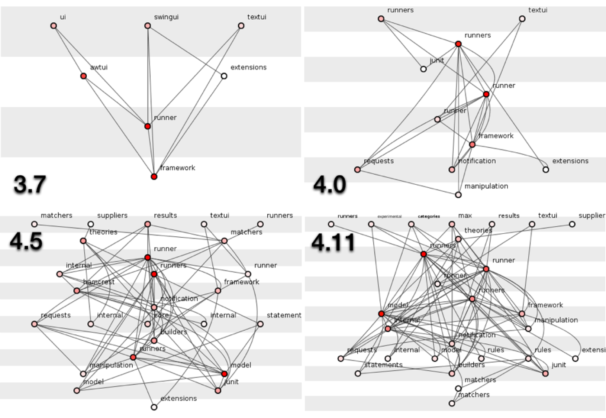


Software evolves and we need to manage it’s complexity otherwise it will become very difficult to maintain


##Code Quality: Why to care?
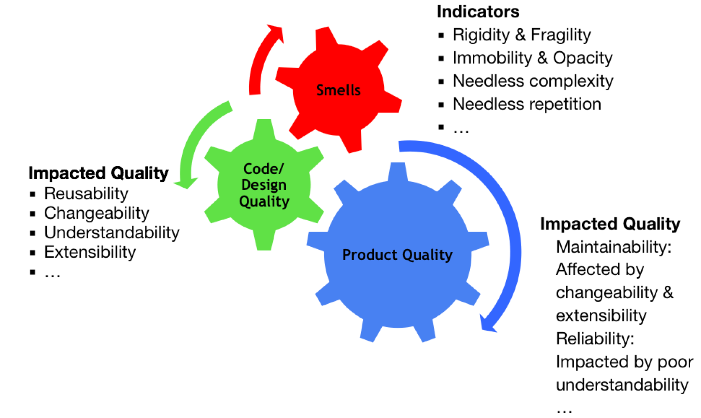


##Part 1 - Software Metrics


##Metrics - What and Why?
* <b>What</b>
  * A software metric is a measure of some property of a software system.

<br>
* <b>Why?</b>
  * "Measurement is the first step that leads to control and eventually to improvement. If you can’t measure something, you can’t understand it." (by James Harrington)


##Object Oriented Metrics
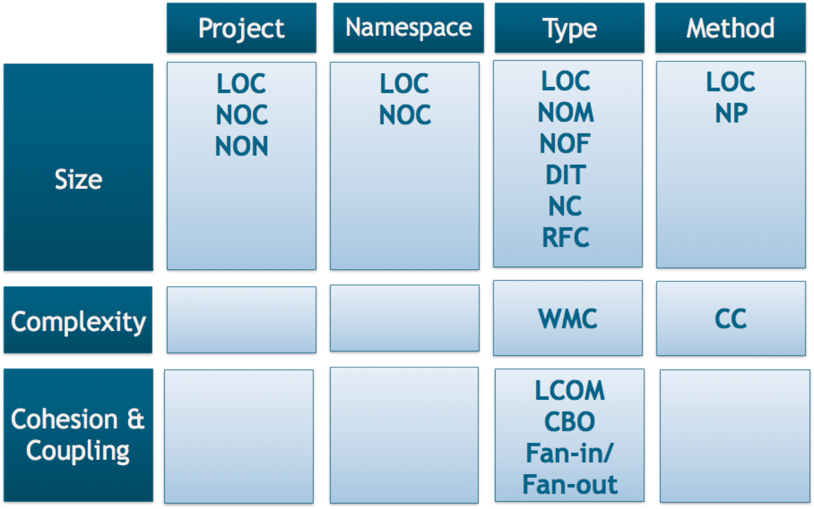


##OO Metrics (Size)

* Large entities make the comprehension difficult.
* Large entities indicate presence of various smells.


##OO Metrics (Size - Hierarchy)

* Excessively deep or wide inheritance trees make the comprehension difficult.
* The deeper a class is in the hierarchy, the greater the number of methods it is likely to inherit, making it more complex to predict its behaviour. 
* A wide hierarchy indicates missing intermediate inheritance level that in turn may lead to code duplication.


##OO Metrics (Cohesion and Coupling)


<p>Consider a class C with n methods M1, M2..., Mn. </p>
<p>Let {Ij} = set of instance variables used by method Mi. 
There are n such sets I1 ,…, In</p>
<p>P = {(Ii, Ij) | (Ii ∩ Ij ) = ∅}</p>
<p>Q = {(Ii, Ij) | (Ii ∩ Ij ) ≠ ∅}</p>

LCOM = |P| - |Q|, if |P| > |Q| 

= 0, otherwise


##OO Metrics (Cohesion and Coupling)


High LCOM indicate the violation of the Single Responsibility Principle.


##OO Metrics (Cohesion and Coupling)
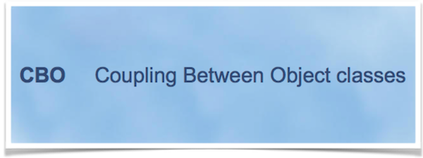
* CBO for a class is a count of the number of other classes to which it is coupled.
* Excessive coupling between object classes is detrimental to modular design and prevents reuse. The more independent a class is, the easier it is to reuse it in another application. 
* The higher the inter-object class coupling, the more rigorous the testing needs to be.


##OO Metrics (Complexity)

* CC - It is a quantitative measure of the number of linearly independent paths through a program's source code. 
* WMC – Sum of CC of each method in the class


##OO Metrics (Complexity)

* The number of methods and the complexity of methods involved is a predictor of how much time and effort is required to develop, test, and maintain the class.


##Tools to compute metrics
* <b>Java</b> 
  - Source Monitor (http://www.campwoodsw.com/sourcemonitor.html)
  - Jarchitect (http://www.jarchitect.com/)
  
* <b>C#</b>
  - Designite (http://www.designite-tools.com)
  - NDepend (http://www.ndepend.com/)


##Part 2 - Software Smells


##Jugaad


##Jugaad
* Jugaad (alternatively Juggaar) is a colloquial Hindi word that can mean an <b>innovative fix</b> or a simple <b>work-around</b>, used for solutions that bend rules, or a resource that can be used as such, or a person who can solve a complicated issue.
* Kind of a <b>hack</b>.


##Jugaad


##Jugaad


##Jugaad


##Jugaad


##Jugaad


##Smells are Jugaads in software
* They solve some problem but introduces quality deficit
* They cannot be long term solutions
* However, there is a difference between smells and Jugaads; Jugaads solve a problem when resources are restricted (innovation) where as smells arise many a time due to ignorance.


##Smell Granularity
* Smells can be classified based on the granularity of abstraction where the smell arises and affects.
  * Architecture smells
  * Design smells
  * Implementation smells


##Implmentation smells
* Long Method
* Complex Method
* Long Parameter List
* Long Identifier
* Long Statement
* Complex Conditional
* Empty Catch Block
* Magic Number
* Duplicate Code


##Design Smells
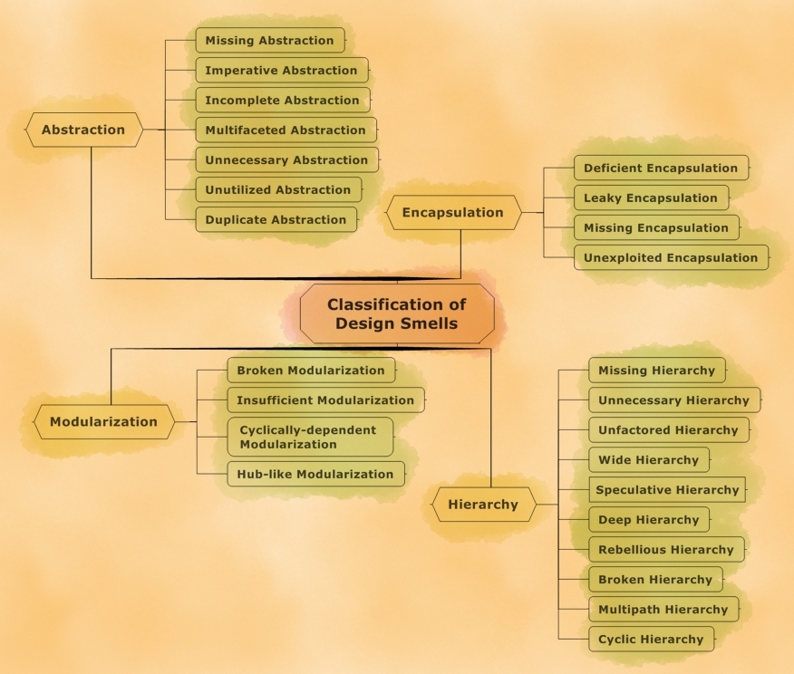


##Example
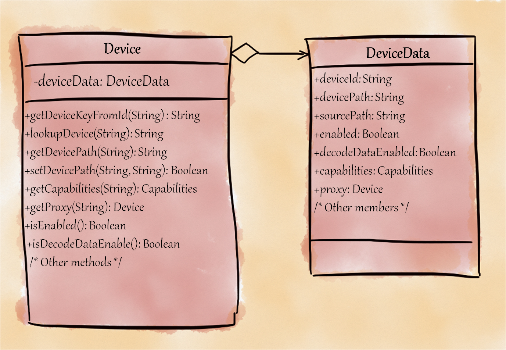


##Broken Modularization
This smell arises when members of an abstraction are broken and spread across multiple abstractions (when ideally they should have been localized into a single abstraction). 


##Example
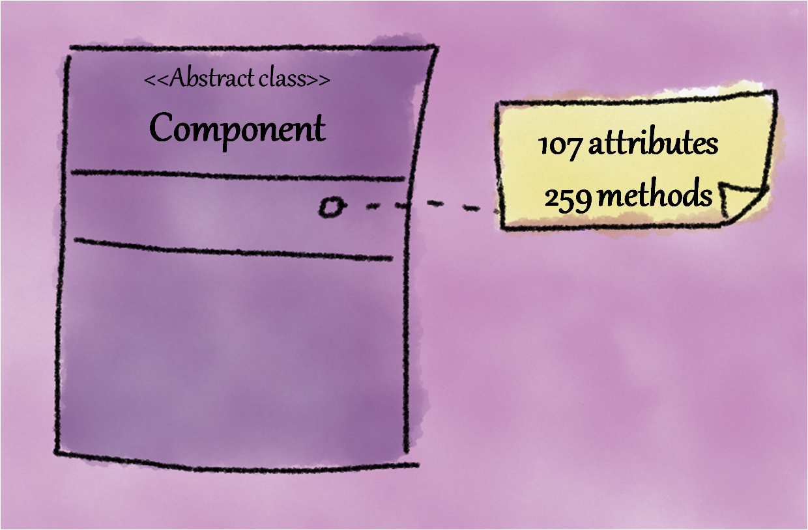


##Insufficient Modularization
This smell arises when an abstraction exists that has not been completely decomposed and a further decomposition could reduce its size, implementation complexity, or both.


##Example
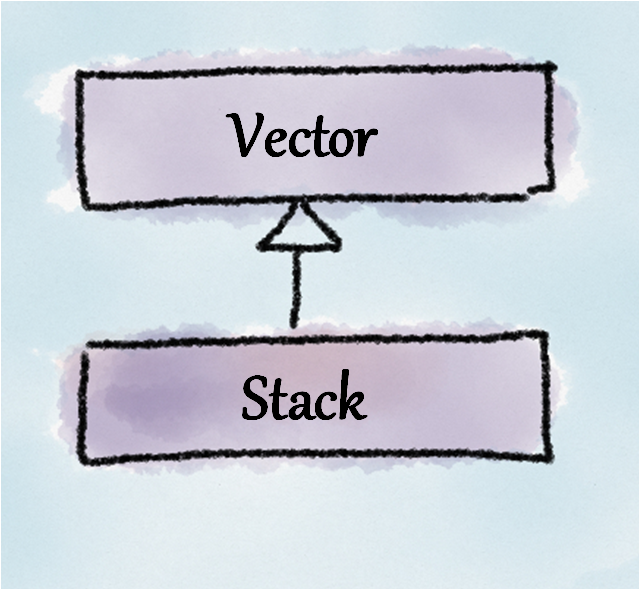


##Broken Hierarchy
This smell arises when a supertype and its subtype conceptually do not share an “IS-A” relationship resulting in broken substitutability. 


##Example
```java
public class Throwable {
  // following method is available      
  // from Java 1.0 version. 
  // Prints the stack trace as a string 
  // to standard output 
  // for processing a stack trace, 
  // we need to write 
  // regular expressions 
  public void printStackTrace();     

// other methods elided 
}
```


##Missing Abstraction
This smell arises when clumps of data or encoded strings are used instead of creating a class or an interface.


##A tool to detect these smells
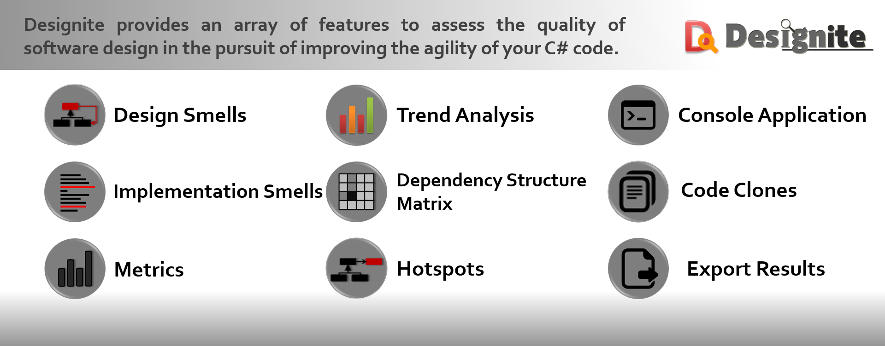
http://www.designite-tools.com


##Further reading


##Part 3 - Refactoring
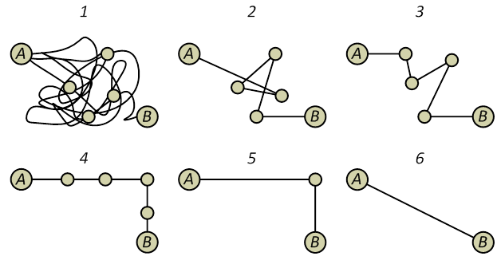


##Once upon a time...
<ul>
<li>A software system
</li>
<ul>
<li>three different variants (standard, pro, ultimate)</li>
<li>trial and release versions</li>
</ul>
<li>The code was filled with conditional compiling statements that make the code messy.</li>
<li>Even worst, we need to make changes (such as version number, product name) at huge number of places to release a variant.</li>

<li class="fragment">I bring the changes to one file. Thus, changes are required only in one file in order to release a variant/version.</li>
<li class="fragment">What I did? Bingo…. REFACTORING!</li>
</ul>
<aside class="notes">
A  software system that comes in three different variants (standard, pro, ultimate) along with trial and release versions.
I was asked to fix a bug and release a new set of variants with both versions.
The code was filled with conditional compiling statements that make the code messy.
Even worst, we need to make changes (such as version number, product name) at huge number of places to release a variant.
Frustrated and annoyed with the exercise, I summarized the list of places where a change is required to release a variant.
I bring the changes to one file. Thus, changes are required only in one file in order to release a variant/version.
What I did? Bingo…. REFACTORING!</aside>


##Definition
* Opdyke introduced the term “Refactoring” and defined as <q>“behavior-preserving program restructuring”</q>.

* According to Fowler 
<q>“Refactoring is the process of changing a software system in such a way that it does not alter the external behavior of the code,  yet improves its internal structure.”</q>


##Why to Refactor?
* Refactoring improves
  * Understandability
  * Extensibility and Flexibility
  * Testability
  * Reusability
  
<b class="fragment">Better code/design quality leads to improved productivity as well as high morale and motivation of the team</b>


##Refactoring Techniques


##Are these names conveying the right message??
```java
double round_type5(double n)
{
	double d,d1,d2,d3;
	
	d=n*100;
	d=(int)d/100;

	d1= ((d*100) - ((int)d) * 100)/100; 
	d1+=2.5;
	d2= (((int)(d1/5))*5)/100;
	d3 = (int)d +d2;
	return d3;
}
```


##What about this?
```java
double roundToNearestPoint05(double number_in)
{
	double roundedNo, fractionalPart, roundedFracPart, result;

	roundedNo=number_in*100;
	roundedNo=(int)roundedNo/100;

	fractionalPart= ((roundedNo*100) - ((int)roundedNo) * 100)/100; 
	fractionalPart+=2.5;
	roundedFracPart= (((int)(fractionalPart/5))*5)/100;
	result = (int)roundedNo +roundedFracPart;
	return result;
}
```
```java
double round_type5(double n)
{
	double d,d1,d2,d3;
	
	d=n*100;
	d=(int)d/100;

	d1= ((d*100) - ((int)d) * 100)/100; 
	d1+=2.5;
	d2= (((int)(d1/5))*5)/100;
	d3 = (int)d +d2;
	return d3;
}
```


##Refactoring - “Renaming variable to more meaningful name” 
* Name of a variable plays important role in describing the behavior to the developer.
* Unclear, meaningless or confusing names make the things hard to understand.
* This activity can be aligned with coding style followed.


##Example
```cpp
void printAppObjects(cInvoice *invoiceObj, list<cItem *> itemContainer)
{
    list<cItem*>::iterator itemItr = itemContainer.begin();
    
    while(itemItr != itemContainer.end())
    {
        cout<<(*itemItr)->getItemName()<<endl;
        cout<<(*itemItr)->getItemPrice()<<endl;
        cout<<(*itemItr)->getItemTaxes()<<endl;
    }
    cout<<"Total items:"<<invoiceObj.getItemCount()<<endl;
    cout<<"Total amount:"<<invoiceObj.getTotalAmount()<<endl;
    cout<<"Total taxes:"<<invoiceObj.getTotalTaxes()<<endl;
}
```


##A better way
```cpp
void printAppObjects(cInvoice *invoiceObj, list<cItem *> itemContainer){
    printAllItems(itemContainer);
	printInvoiceObj(invoiceObj); 
}
void printAllItems(list<cItem*> itemContainer) {    
	list<cItem*>::iterator itemItr = itemContainer.begin();
    while(itemItr != itemContainer.end()) {
		cout<<(*itemItr)->getItemName()<<endl;
		cout<<(*itemItr)->getItemPrice()<<endl;
        		cout<<(*itemItr)->getItemTaxes()<<endl;     
	}
 }
void printInvoiceObj(cInvoice *invoiceObj){
    cout<<"Total items:"<<invoiceObj.getItemCount()<<endl;
    cout<<"Total amount:"<<invoiceObj.getTotalAmount()<<endl;
    cout<<"Total taxes:"<<invoiceObj.getTotalTaxes()<<endl; 
}
```


##Refactoring - “Extract method” 
* Applicability
  * Multiple responsibilities for single method.
  * Quite large method.
  * Duplicated code block.


##Example
```java
if(itemObj.getAvailableUnits() > requiredUnits && 
  itemObj.getExpiryDate()>date() && 
  itemObj.getUnitWeight()== requiredUnitWeight)
{
		…
}
else
{
		…
}
```


##A better way
```java
if(isItemSellable(…))
{
		…
} 
else 
{
		…
}

int isItemSellable(…) {
	return (itemObj.getAvailableUnits() > requiredUnits 
    && itemObj.getExpiryDate()>date() && 
    itemObj.getUnitWeight()== requiredUnitWeight);
}
```


##Refactoring - “Decompose conditional” 
* Complicated conditional logic with their actions make code harder to read and understand.
* The ‘Decompose conditional’ Refactoring introduces another layer of abstraction and encapsulates complex conditional logic and corresponding actions into separate methods.


##Example
```java
switch(angle)
{
  case 90:
    rotateBy90(…); 	
    break;
  case 180:
    rotateBy180(…); 	
    break;
}

int rotateBy90(…)
{ …}

int rotateBy180(…)
{… }
```


##Refactoring - "Parameterized Method"
```java
rotate(angle);

int rotate(angle, …)
{ …}
```


##Approching "design-level" refacorings
* It requires the knowledge of the big picture.

* <b>Sense</b>
  * Difficulty in making changes
  * Comprehension woes

* <b>Identify</b>
  * Presence of design smells
  * “Red” values of object-oriented metrics

* <b>Refactor</b>
  * Roll of context
  * Design principles


##Example
```java
class GraphicsDevice {
 public void setFullScreenWindow(Window w) {
        if (w != null) {
            if (w.getShape() != null) { w.setShape(null); }
            if (w.getOpacity() < 1.0f) { w.setOpacity(1.0f); }
            if (!w.isOpaque()) {
                Color bgColor = w.getBackground();
                bgColor = new Color(bgColor.getRed(), bgColor.getGreen(), bgColor.getBlue(), 255);
                w.setBackground(bgColor);
            }
        }
…
}
```
<ul>
<li class="fragment">This code in GraphicsDevice uses more methods of Window class than calling its own methods!
</li></ul>


##Refactoring - “Move Method”
* Put apples with apples
  * Improves cohesion
  * Reduces coupling
  * Reduces the size of a big class
  * Typically employed to remove “feature envy” smell

* A related refactoring is “Move field”


##Refactoring - “Move Method”
* <b>Mechanism</b>
  * Identify a block to be moved to other class (identify that class too).
  * Check whether you can safely move the code (overridden?, side effects?)
  * Create a method in the target class
  * Move the block to the target method
  * Replace the block with method call
  * Adjust and align (look for parameters in and out)
  * Compile and test

* <b>Consequences</b>
  * A more cohesive, smaller method/class
  * Typically carried out in groups (with fields/methods)


##Example
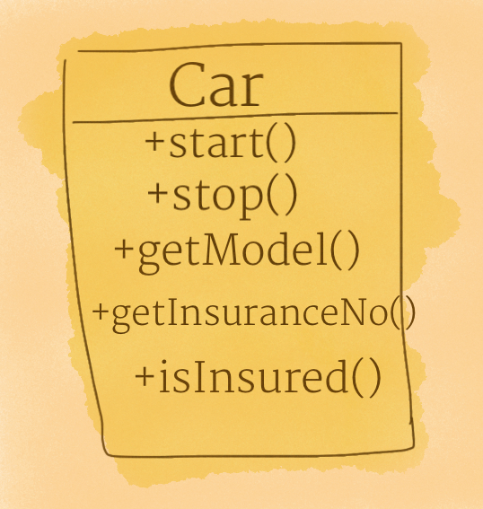


##Refactoring - "Extract Class"
* Each abstraction should have a unique responsibility.

* In case, an abstraction is changed for multiple causes then it is a multifaceted abstraction (having multiple responsibilities).

* Extract-class refactoring splits a multifaceted abstraction into multiple cohesive smaller abstractions.


##Refactoring - "Extract Class"
* <b>Mechanism</b>
  * Identify a responsibility that needs to be split and create a class for the responsibility.
  * Apply “move field” refactoring
  * Apply “move method” refactoring
  * Establish association between clients and the new class
  * Check clients are not breaking
  * Compile and test

* <b>Consequences</b>
  * It improves cohesion and coupling measures
  * It may break client’s code


##Other Refactorings
* Renaming variable to more meaningful name
* Split temporary variable
* Consolidate duplicate conditional fragments
* Extract class/interface/method/package/sub-class/super-class
* Form template method
* Introduce parameter object
* Move class/method/field
* Pull-up field/method
* Push-down field/method
* Replace conditional with polymorphism
* Replace constructor with factory method
* Replace type code with state/strategy pattern


##Using IDEs to refactor
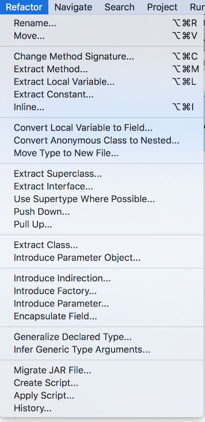


##Further reading
