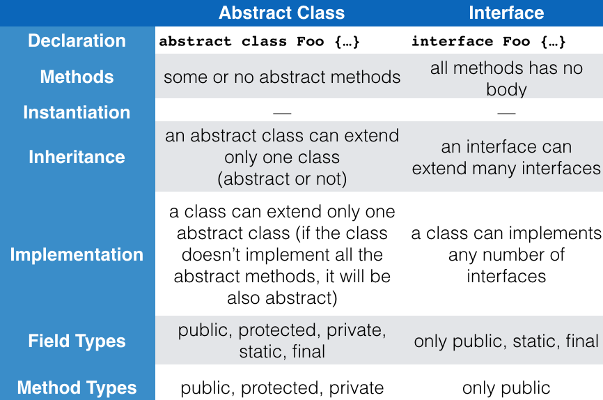

## What is an interface?

* Think about objects and methods first.
* Objects define their interaction with the outside world through their methods.
* Methods form an object's interface with the outside world.
* For example, the buttons on your television set are the interface between you and the device. You press the "power" button to turn the television on.


## Which are the characteristics of an interface? 

* An interface is a group of related methods with empty bodies.
* An interface declaration can contain
method signatures, default methods, static methods and constant definitions.
* The only methods that have implementations are default and static methods.
* An interface has the keyword ```interface``` in its declaration.
```java
public interface Foo {...}
```


## A simple example

```java
interface Bicycle {

    void changeCadence(int newValue);

    void changeGear(int newValue);

    void speedUp(int increment);

    void applyBrakes(int decrement);
}
```


## How can we implement an interface?

* To implement an interface, we use the ```implements``` keyword in the declaration of our class.

```java
class ACMEBicycle implements Bicycle { ... }
```


## A simple example (cont'd)
```java
class ACMEBicycle implements Bicycle {
    int cadence = 0;
    int speed = 0;
    int gear = 1;
    
   // The compiler will now require that methods
   // changeCadence, changeGear, speedUp, and applyBrakes
   // all be implemented. Compilation will fail if those
   // methods are missing from this class.

    void changeCadence(int newValue) {
         cadence = newValue;
    }

    void changeGear(int newValue) {
         gear = newValue;
    }

    void speedUp(int increment) {
         speed = speed + increment;   
    }

    void applyBrakes(int decrement) {
         speed = speed - decrement;
    }

    void printStates() {
         System.out.println("cadence:" +
             cadence + " speed:" + 
             speed + " gear:" + gear);
    }
}
```


## Why to use interfaces?

* An interface allows the class that implements the interface to become formal about the behavior it provides. 
* Interfaces form a contract between the class and the outside world. 
* This contract is enforced at build time by the compiler.


## Abstract classes Vs. interfaces




## Abstract class OR interface?

* Use an abstract class to:
<ul>
<li>share code among several closely related classes</li>
<li>declare non-static or non-final fields</li>
</ul> 

* Use an interface:
<ul>
<li>when you want to permit multiple implementations of the interface</li>
<li>when you want to take advantage of multiple inheritance</li>
<li>when you are willing to design it carefully</li>
</ul> 


## Interfaces as APIs

* An interface can be used as an industry standard Application Programming Interface (API). 
* APIs are common in commercial software products.  
* Think for a example a company that sells a package of digital image processing methods (as interfaces) to companies (API clients) that make end-user graphics programs.


## What if we want to change an interface?

* If you make this change (e.g. add a new method),
then all classes that implement your interface will break
because they no longer implement the old interface.


## What if we want to change an interface? (cont'd)

* Two solutions would be:
<ul>
<li>You could create a new interface that extends your old one.</li>
<li>Alternatively, you can define your new methods as default methods.</li>
</ul> 


## Default methods
```java
public interface DoIt {

   void doSomething(int i, double x);
   int doSomethingElse(String s);
   default boolean didItWork(int i, double x, String s) {
       // Method body 
   }
   
}
```


## Exercise 1a

* Write and interface called Shape that declares two abstract methods: getParameter() and getArea().


## Exercise 1b

* Write the implementation class Circle, with a protected variable radius, which implements the interface Shape.


## Excercise 1c

* Create the class ResizableCircle that is a subclass of the class Circle.  ResizableCircle implements an interface called Resizable. The interface Resizable declares an abstract method resize(), which modifies the dimension (i.e. radius) by the given percentage. Write the interface Resizable and the class ResizableCircle.


## Exercise 2a

* Create an interface called Agreeable that declares how to compare two objects. The interface has an abstract method called isSmallerThan(Agreeable other). Then, create a class called Shape that implements the Agreeable interface. Shape has two fields: int width, int height. The class has two constructors, one with empty arguments and one with two arguments, width and height.


## Exercise 2b

* The class Shape has two methods. The first method is called calcArea and returns the area i.e. (int) weight * height. The second area implements the Agreeable interface.


## References

* https://docs.oracle.com/javase/tutorial/java/concepts/interface.html
* https://www3.ntu.edu.sg/home/ehchua/programming/java/J3f_OOPExercises.html

