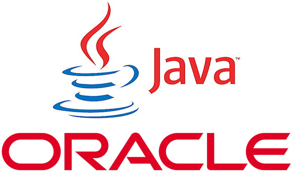
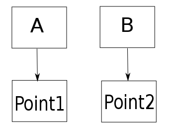
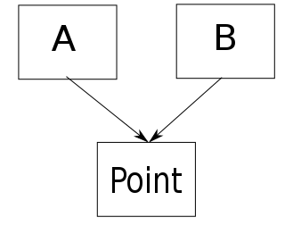
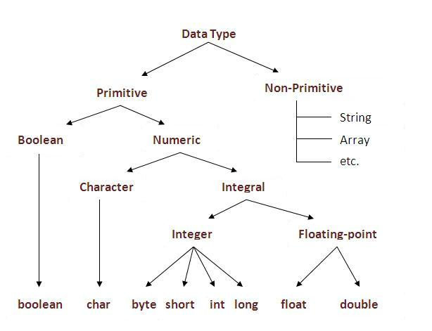

## Aim of the course
* Introduction to Object-Oriented Programming
* Thinking in OOP
* Defining objects
* Creating and handling objects
* Using objects to solve problems


## Java as an OOP Language
* Java offers the possibility to extend the programming language by adding new data types accodring to our needs
* Programmer defines the class to fit a problem rather than being forced to use an existing data type
<div style="text-align:center" markdown="1">

</div>


## Alan Kay's principles for OOP
* Used five characteristics to create Smalltalk
* Java is based on those five principles
<div style="text-align:center" markdown="1">

</div>


## Principle 1 - Everything is an object
* Think of it as a variable
* Stores data
* You can make request to that object to perform an action


## What is an object
* It can have one from many fields (variables and properties)
* Each of the fields contains data that declares the state of the object
* It can have one from many methods (functions)
* Each method performs an action that may modify the state of the object
* Methods and fields are both members of the object


## Example of an object


## Classes
* Objects of the same type are classified under the same class
* Fields and methods are declared inside a class
```java
	impot java.util.*;
	public class CalendarTesting {
		public static void main(String[] args) {
			GregorianCalendar today, yesterday;
		}
	}
```	


## Creating new objects
* Every newly created object has its own copy of field and methods
* Variables declared as objects have a pointer (reference) on memory where the object data exist


## Object memory allocation by calling new
```java
	public class BootCamp {
		public static void main(String[] args) {
			BootCamp a, b;
			a = new BootCamp();
			b = new BootCamp();
		}
	}
```



## Object memory allocation by copying
```java
        public class BootCamp {
                public static void main(String[] args) {
                        BootCamp a, b;
                        a = new BootCamp();
                        b = a;
                }
        }
```




## Principle 2 - A program is a bunch of objects communicating with each other
* To request an action from an object we "send a message"
* The send message is a call to a method belonging to that object


## Call method, function
```java
        public class BootCamp {
                public static void main(String[] args) {
                        BootCamp a;
                        a = new BootCamp();
                        a.printSomething();
                }

		public static void printSomething() {
			System.out.println("Hello BootCamp 2016");
		}
        }
```


## Access properties, instance variables, fields
* We can always access the fields (variables) of an object with this syntax: object.variable
* Is not a usual practice to access variables with the aforementioned way
* Getting or modifiying variables is done with the use of Getters and Setters methods.


## Scope
* When declaring variables or methods as public in a class, means they are accessible from outside objects.
* Variables declared as private or protected are only accessibly from the methods of the class that declares them. 


## Scope Examsle: BootCamp Class
```java
	public class BootCamp {
		//Public and private variables
		public int number1, number2;
		private boolean visible;
		private int javaProgramming;
		//Private method
		private void setNumbers(int one, int two) {
			number1 = one;
			number2 = two;
		}
		//Public method
		public void changeNumbers() {
			setNumbers(1,9);
		}
	}
```


## Scope Example: Main
```java
	public class BootCampTest {
		public static void main(String[] args) {
			BootCamp a;
			a = new BootCamp();
			a.changeNumbers();
			a.number1 = 10;
			a.javaProgramming = 1;
			a.setNumber(10,11);
		}	
	}
```


## Scope Example: variable visibility
```java
	public class BootCamp {
		public static void main(String[] args) {
			int x;
			x = 0;
    			if (x = 10) {
				int y = 10;
				System.out.println("x and y:" + x + y);
				x = y * 2;
			}
			y=100;
			System.out.println("x is: "+x);
		}
	}
```


## Principle 3 - Each object has its own memory made up of other objects
* Existing objects are composed to create new objects
* Complexity of objects are build step by step


## Principle 4 - Every object has a type
* Every instance of a Class is an object
* Class is a synonym of Type


## Principle 5 - All objects of particular type can receive the same messages
* Objects from the same family can receive the same function call
 


## Problem Space
* A problem  may consists of one or more elemets
* Each element defines a problem to be solved
<br><div style="text-align:center" markdown="1">

</div>


## Solution Space
* The mapping between elements of Problem Space and objects
* Each of the object(s) may represent a solution for the element(s)
<div style="text-align:center" markdown="1">

</div>


## The call of Constructor (1)
* For each Class we can assign constructor which must have the same name as the Class
* Each time we like to create an object, Java calls a constructor, if none exist, it calls the default constructor
* Destructor is a method that destroys an object when the program ends


## The call of Constructor (2)
* When program reach its memory bounds Garbage Collector is called to delete unused objects or it can be called on-demand.
* A constructor can be called with arguments (variables) in order to initialize its state
* One Class can have from one to many constructors with different number of arguments.


## Calling Constructor - Example 
```java
	 public class BootCamp {
		BootCamp() {
		//Do nothing		
		}
		
                public static void main(String[] args) {
                        BootCamp a = new BootCamp();
                }
        }

```


## Class methods and fields
* Methods and fields declared as static can be called without creating an object
* Class.Method and Class.Field for methods and fields, respectively
* Fields declared as final are constant and their values cannot change


## Class methods fields - Example 
```java
	public class FindDay {
 		public static String weekDayName(int weekNumber) {
    			switch (weekNumber) {
    				case Calendar.MONDAY: return "Monday";
    				case Calendar.TUESDAY: return "Tuesday";
    				case Calendar.WEDNESDAY: return "Wednesday";
    				case Calendar.THURSDAY: return "Thursday";
    				case Calendar.FRIDAY: return "Friday";
    				case Calendar.SATURDAY: return "Saturday";
    				case Calendar.SUNDAY: return "Sunday";
    }
  }

  public static void main(String args[]) throws Exception {
  	FindDay today = new FindDay();
	System.out.println(FindDay.weekDayName(4));
}
}
```


## Methods for all objects
* Object clone() - Returns a copy of an object
* String toString() - Returns a string that represents the object
* boolean equals(Object obj) - Returns true if the object is equal with obj


## toString example
```java
	String toString()
	static String toString(int i)
```

```java
	public class TestingToString {
		public static void main(String[] args) {
			Integer variable1 = 2016;
			int variable = 2016;
			System.out.println(variable1.toString());
			System.out.println(Integer.toString(2016));
			System.out.println(variable.toString()); //Correct?
		}
	}	
```


## Equals example
```java
	public boolean equals(Object obj)
```

```java
	public class TestingEquals {
		public static void main(String[] args) {
			String str1 = new String("BootCamp 2016");
			String str2 = new String("Learning OOP");

			if (! str1.equals(str2)) {
				System.out.println("They are not");
			} else {
				System.out.println("They are");
			}
		}
	}
```


## Arrays in Java
```java
	int[] array = new int[]{1,4,5,6};
	System.out.println("The size of array is"+ array.length);
```

```java
	String[] array = new String[]{"Hello BootCampers"," how are you"};
        System.out.println(Arrays.toString(array));
```


## Data types
* Type&nbsp;&nbsp;&nbsp;&nbsp;Bits&nbsp;&nbsp;&nbsp;&nbsp;Range
* byte&nbsp;&nbsp;&nbsp;&nbsp;&nbsp;8&nbsp;&nbsp;&nbsp;&nbsp;-128 till 127
* short&nbsp;&nbsp;&nbsp;&nbsp;16&nbsp;&nbsp;&nbsp;&nbsp;-32768 till 32767
* int&nbsp;&nbsp;&nbsp;&nbsp;&nbsp;&nbsp;&nbsp;32&nbsp;&nbsp;&nbsp;&nbsp;-2^31 till 2^31 -1
* long&nbsp;&nbsp;&nbsp;&nbsp;&nbsp;64&nbsp;&nbsp;&nbsp;&nbsp;-2^63 till 2^63 -1
* float&nbsp;&nbsp;&nbsp;&nbsp;&nbsp;32&nbsp;&nbsp;&nbsp;&nbsp;Single Precision
* double&nbsp;&nbsp;&nbsp;64&nbsp;&nbsp;&nbsp;&nbsp;Double Precision


## Primitives vs Non-Primitives



## Τype casting (1)


## Type casting (2)
* It's allowed to convert from a small to a larger number of bits data type or the opposite
* By converting from a large to a small data type we may lose information

<br>double avg = (double) 12/5
<br>int rnd = (int) (29.4/10.0)
<br>Integer xd = (Integer) rnd


## Incrementing Examples (1)
* Example 1:
 <br> x = 10; 
 <br> y = ++x;

* Example 2:
 <br> x = 10;
 <br> y = x++;


## Incrementing Examples (2)
* Example 1:
 <br> x = 10;
 <br> y = ++x;
 <br> x = 11 and y = 11

* Example 2:
  <br> x = 10;
  <br> y = x++;
  <br> x = 11 and y = 10


# Exercise 1
<div style="text-align: justify;">
Create a static function, with the name "bootCamp", that receives as an input two int arguments, i.e., number1 and number2, and returns an int result in the end. If "number1" is smaller that "number2" then returns the square root (use Math.sqrt method) of the absolute value (use Math.abs) of the difference among "number1" and "number2". Else return the sum of the two numbers.
<br> Number1 = 25, Number2 = 91
<br> Number1 = 91, Number2 = 25
</div>


## Exercise 1 result
First: 8, Second: 116


## Exercise 2
<div style="text-align: justify;">
Create a program that simulates the roll of two dices. The program must execute till both dices return 1 as a result (use Math.random). You can create a class name Dice which has a void roll method. Roll method is rolling the dices till the needed results is aquired and prints the number of rolls needed in order to have two 1s.
</div>


## Exercise 3
<div style="text-align: justify;">
Create an array that can receive 10 elements, as a size, and add in each position an element starting from 1 to 10 statically and print the array. Afterwards, create a method (function) that can shift the array elements right by 10 times. The 10 is given by the user as an input. At the end print the shifted array.
</div>


## Exercise 3 result
<br>[10, 1, 2, 3, 4, 5, 6, 7, 8, 9]
<br>[9, 10, 1, 2, 3, 4, 5, 6, 7, 8]
<br>[8, 9, 10, 1, 2, 3, 4, 5, 6, 7]
<br>[7, 8, 9, 10, 1, 2, 3, 4, 5, 6]
<br>[6, 7, 8, 9, 10, 1, 2, 3, 4, 5]
<br>[5, 6, 7, 8, 9, 10, 1, 2, 3, 4]
<br>[4, 5, 6, 7, 8, 9, 10, 1, 2, 3]
<br>[3, 4, 5, 6, 7, 8, 9, 10, 1, 2]
<br>[2, 3, 4, 5, 6, 7, 8, 9, 10, 1]
<br>[1, 2, 3, 4, 5, 6, 7, 8, 9, 10]


## Exercise 4
<div style="text-align: justify;">
Convert exercise 1 array and it's elements, from int, to Double. P.S. not double but Double.
</div>


## Exercise 5
<div style="text-align: justify;">
Implement a tic tac toe (triliza) game which is played by two players. You may use one or two dimention array to store the results (the 'X' and 'O'). You can use a while loop to give turns for the 'X' or the 'O' player. 
<br>Create a drawFunction that can take as an argument the array and print the current tic tac toe's status before each players turn. 
Create function that can check rows, columns, and diagonals, which is performed after a player played his symbol, 'X' or 'O', and prints win if there is a winner, otherwise the game still goes on if and if there is available position in the array. If a player placed his symbol in an occupied position print an error message and let him play again. </div>


## References
* Link: http://www.dmst.aueb.gr/dds/isdi/idxprint.htm
* Eckel, Bruce. Thinking in JAVA. 4th ed. Prentice Hall, 2006.
