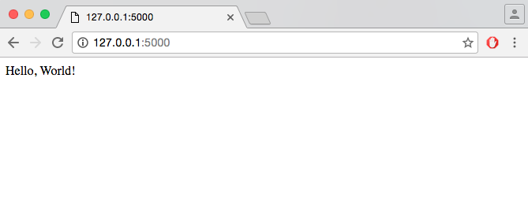
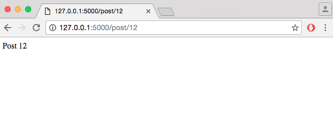

## What is Flask?

* A Python framework for building web applications (sites, blogs, wiki, etc.)

* Flask provides you tools, libraries, and technologies that allow you to build a web application


## Flask dependencies

* Flask depends on some external libraries (Werkzeug and Jinja2)

* Werkzeug is a toolkit for the standard Python interface between web applications and a variety of servers for both development and deployment

* Jinja2 renders templates


## How to handle dependencies

* Using virtualenv

* Virtualenv enables multiple side-by-side installations of Python, one for each project

* It helps to keep different project environments isolated

* On each project you can work with different versions of Python itself and Python libraries


## How to install virtualenv on Mac OS X or Linux

```sh
$ sudo pip install virtualenv
```


## How to install virtualenv on Ubuntu

```sh
$ sudo apt-get install python-virtualenv
```


## How to install virtualenv on Microsoft Windows

* First install pip and setuptools

* See instructions [here](http://flask.pocoo.org/docs/0.11/installation/#windows-easy-install)

* Upgrade pip and install virtualenv

```sh
$ pip install --upgrade pip setuptools
```

```sh
$ pip install virtualenv
```


## How to create a new Flask project I

* Fire up a shell an give the following commands

* Create a project and change directory

```sh
$ mkdir app
```

```sh
$ cd app
```


## How to create a new Flask project II

* Create a venv folder in your project

```sh
$ virtualenv venv
```

* Activate the environment of your project

on Mac OS X or Linux

```sh
$ . venv/bin/activate
```

on Microsoft Windows

```sh
$ venv\scripts\activate
```


## How to create a new Flask project III

* Get Flask in your virtualenv

```sh
$ pip install Flask
```

* Deactivate your virtualenv

```sh
$ deactivate
```


## A minimal app I

```python
from flask import Flask
app = Flask(__name__)

@app.route('/')
def hello_world():
    return 'Hello, World!'
    
if __name__ == '__main__':
   app.run(debug = True)
```

* Import the Flask class

* Create an instance of this class

* Use the route() decorator to tell Flask what URL should trigger

* Set to the function the message that we want to display in the user's browser

* Save the python file as hello.py in a folder named app


## A minimal app II

* To run the app write the following commands and open a browser

```sh
$ cd ./app
$ export FLASK_APP=hello.py
$ flask run
 * Running on http://127.0.0.1:5000/
```

* On Microsoft Windows use set instead of export


## A minimal app III




## Variable rules I

* We can add variable parts to a URL by marking special sections as <variable_name> or <converter:variable_name>

```python
@app.route('/hello/')
@app.route('/hello/<name>')
def hello_name(name):
   return 'Hello %s!' % name
```


## Variable rules II


## Variable rules III

```python
@app.route('/post/<int:post_id>')
def show_post(post_id):
    # show the post with the given id, the id is an integer
    return 'Post %d' % post_id
```


## Variable rules IV




## Unique URLs / Redirection behaviour

* Flask's URL rules ensure beautiful and unique URLs

```python
@app.route('/projects/')
def projects():
    return 'The project page'

@app.route('/about')
def about():
    return 'The about page'
```


## URL building I

* Flask can also generate URLs 

* To build a URL to a specific function you can use the url_for() function 

* url_for() accepts the name of the function as first argument and a number of keyword arguments, each corresponding to the variable part of the URL rule


## URL building II

```sh
>>> from flask import Flask, url_for
>>> app = Flask(__name__)
>>> @app.route('/')
... def index(): pass
...
>>> @app.route('/login')
... def login(): pass
...
>>> @app.route('/user/<username>')
... def profile(username): pass
...
>>> with app.test_request_context():
...  print (url_for('index'))
...  print (url_for('login'))
...  print (url_for('profile', username='mark'))
...
```


## HTTP Methods

* HTTP (the protocol web applications are speaking) knows different methods for accessing URLs 

* By default, a route only answers to GET requests

* HTTP methods tell the server what the client wants to do with the requested page

* GET: requests data from a specified resource (e.g. a client submits an HTTP request to the server)

* POST: submits data to be processed to a specified resource (e.g. the server returns a response to the client)


## Request example

```python
from flask import request

@app.route('/login', methods=['GET', 'POST'])
def login():
    if request.method == 'POST':
        do_the_login()
    else:
        show_the_login_form()
```


## Static files I

* Static files are usually the CSS and JavaScript files

* Add static files in a folder with the name static in your project

* Import the send_from_directory module and use the send_from_directory() method

```python
from flask import send_from_directory
```
```python
@app.route('/static/css/stylesheet.css')
def serve_static_css(filename):
	root_dir = os.path.dirname(os.getcwd())
	return send_from_directory(os.path.join(root_dir, 'static', 'css'), filename)
```


## Static files II

* To generate URLs for static files, use the special 'static' endpoint name:

```html
<link rel="stylesheet" href="{{ url_for('static', filename='style.css') }}">
```


## Rendering Templates

* Templates are html pages

* Add all the templates should be in a folder with the name templates in your project

* To render a template you import the render_template module and use the render_template() method

```python
from flask import render_template
```
```python
@app.route('/hello/<name>')
def hello(name):
    return render_template('hello.html', name=name)
```


## Template Example

* The hello.html file

```html
<!doctype html>
<title>Hello from Flask</title>

  <h1>Hello {{ name }}!</h1>

  <h1>Hello, World!</h1>

```
* The variables and/or logic are placed between tags or delimiters 

* Templates use  for expressions or logic (like for loops), while {{ ... }} are used for outputting the results of an expression or a variable to the end user


## Result


## Create a form I

* Install Flask-WTF

```sh
$ pip install Flask-WTF
```


## Create a form II

* Create an html form called new.html

```html
<form action="/new" method = "post">
     <label for = "name">Name</label>
     <input type = "text" name = "name" placeholder = "name"/>
     <br>
     <label for = "surname">Surname</label>
     <input type = "text" name = "surname" placeholder = "surname"/>
     <br>
     <label for = "email">Email</label>
     <input type = "text" name = "email" placeholder = "email"/>
     <br>
     <label for = "password">Password</label>
     <input type = "password" name = "password" placeholder = "password"/>
     <br>
     <input id="btnSignUp" type = "submit" value = "Sign up"/>
</form>
```


## Create a form III

* Add a new Python file for the form, i.e. forms.py

* Add the appropriate imports for the validation of the form's fields

```python
from flask import Flask
from flask_wtf import Form
from wtforms import TextField, SubmitField, PasswordField, validators, ValidationError

class ContactForm(Form):
   name = TextField("Name",[validators.Required("Please enter your name.")])
   surname = TextField("Surname",[validators.Required("Please enter your surname.")])
   email = TextField("Email",[validators.Required("Please enter your email address."),
      validators.Email("Please enter your email address.")])
   password = PasswordField('Password', [validators.Required("Please enter your password.")])
   submit = SubmitField("Send")
```


## Create a form IV

* Add the new() method to the python file with the routes/views file called routes.py

* The new() method is called in the form's action in the html page

* Add the appropriate imports

```python
from flask import Flask, request, render_template
from forms import ContactForm
from flask_wtf import Form
from wtforms import validators
```
```python
@app.route('/new', methods = ['GET', 'POST'])
def new():
	if (request.method == 'POST'):
		pass
	return render_template('new.html')
```


## Message flashing

* Add error messages

```python
from flask import Flask, flash, request, render_template
from forms import ContactForm
from flask_wtf import Form
from wtforms import validators
```
```python
@app.route('/new', methods = ['GET', 'POST'])
def new():
	if (request.method == 'POST'):
		if (not request.form['name'] and not request.form['surname'] \
                and not request.form['email'] or not request.form['password']):
			flash('Please fill all the fields.', 'error')
        else:
            return redirect(url_for('hello'))
	return render_template('new.html')
```


## Sessions I

* A session is the time interval when a client logs into a server and logs out of it 

* The data, which is needed to be held across this session, is stored in a temporary directory on the server

* Import the session module from flask in your routes file

```python
from flask import session
```


## Sessions II

* To set a session variable use the statement

```python
session['email'] = 'foo@bar.com'
```

* To release a session variable use the pop() method

```python
session.pop('email', None)
```


## Sessions III

* To use a seesion you should set up a secret key in your routes file

```python
app.secret_key = 'A0Zr98j/3yX R~XHH!jmN]LWX/,?RT'
```


## Log-in

* Add route for the login in the routes file

```python
@app.route('/login', methods=['POST'])
def index():
    if 'email' in session:
        email = session['email']
        return 'You are logged in as ' + email + '<br>' + \
         "<b><a href = '/logout'>click here to log out</a></b>"
	return "You are not logged in <br><a href = '/login'></b>" + \
      "click here to log in</b></a>"
```


## Log-out

* Update the imports in your routes file

```python
from flask import Flask, url_for, redirect
```

```python
@app.route('/logout')
def logout():
   # remove the username from the session
   if 'email' in session:
       session.pop('email', None)
   return redirect(url_for('index'))
```


## Exercise 1.1

* Imagine that you want to develop the web site for a local bookstore. Start by developing an html form (in new.html) that customers can use to add their personal details (name, surname, email, and password) in order to be able to access the online store. Set the action of the form correctly so that to open the login.html page when the customer presses submit.


## Exercise 1.2

* Then, write a Python program (form.py) that validates the form that customers fill and a Python program (views.py) with a function new that opens the new.html page. 


## Exercise 1.3

In views.py add a function called login that:

* Checks if a customer has filled all the fields of the form and opens the new.html page if there are errors.
* If there are errors, accordingly informs customers using flashing messages.


## Exercise 1.3 (continued)

* Otherwise, adds the customer's email to the session after setting that he/she is logged in (i.e. session['logged_in'] = True) and
* opens another html page (hello.html) that says: "Hi <email>! Welcome to our bookstore." Where <email> is the email that the customer has given to the form and it is in the session. Be careful to add any needed routes to views.py.


## Exercise 1.4

* Extend the site by allowing customers to log-out after they log-in.
* Add a function logout (to the views.py) that opens a logout.html page after removing the customer from the session.
* If the customer's email is not in the session, opens the new.html page.


## Exercise 1.5

* Finally, use the following static file to improve a bit the appearence of the form
* Download the css file from http://www.w3schools.com/lib/w3.css and save it in a file called w3.css


## Reference

* http://flask.pocoo.org/docs/0.11/quickstart/