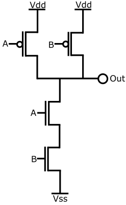
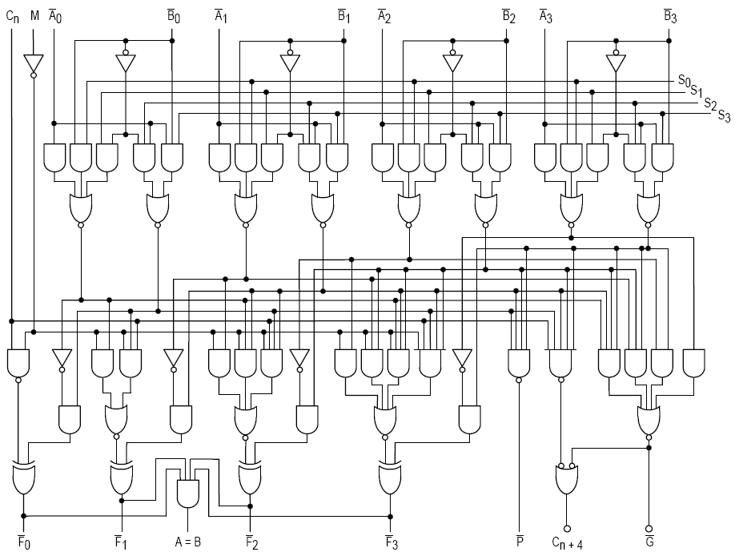
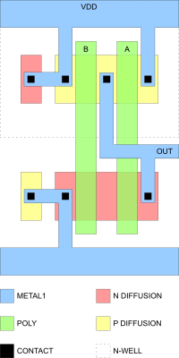
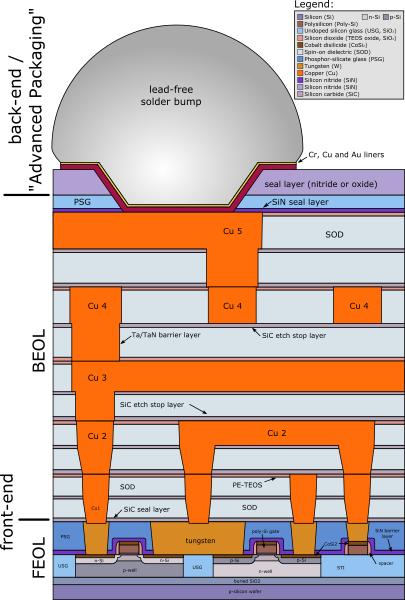
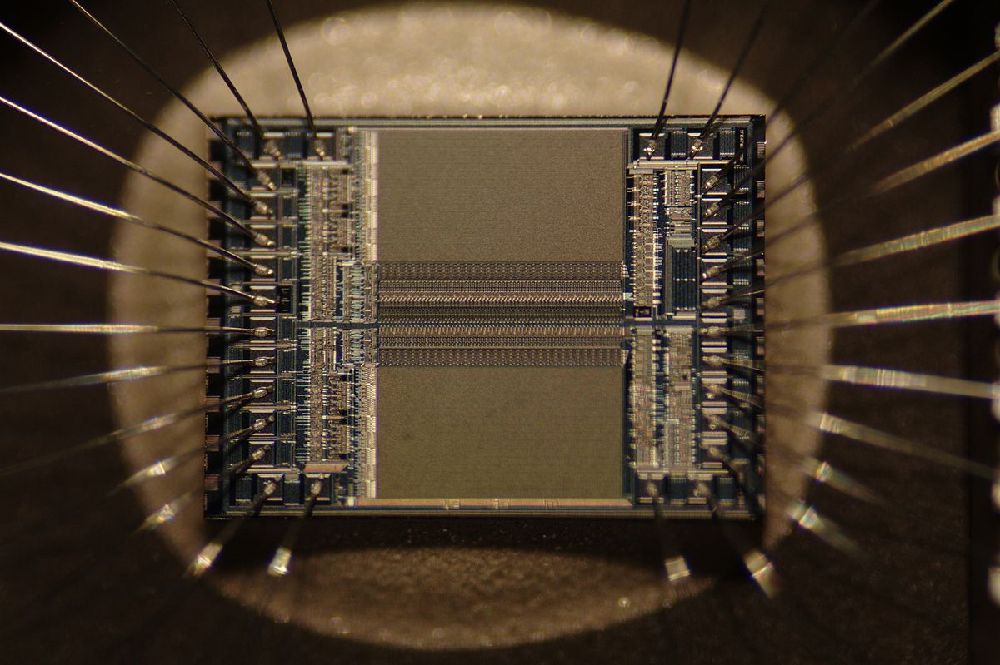
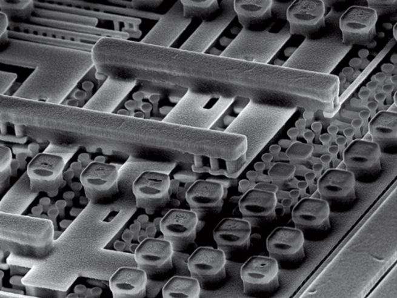

## Transistors and gates
* Transistor: a miniature switch
* Logic gate: digital building block

## A NAND gate as transistors

[By JustinForce - Own work, CC BY-SA 3.0](https://commons.wikimedia.org/w/index.php?curid=2593317)

## Digits and counting
* How to add two bits
* Counting with 0 and 1

## A four bit ALU

[By Poil - Own work, CC BY-SA 3.0](https://commons.wikimedia.org/wiki/File:74181aluschematic.png)

## Chips and chip contruction
* Gates are put together in integrated circuits
* Chips can serve various functions, such as CPU, memory, or interface
* Early ICs contained 2-6 gates (8-30 transistors)
* A modern CPU can contain 20 billion transistors

## A NAND gate in CMOS

[By Jamesm76 at English Wikipedia, Public Domain](https://commons.wikimedia.org/w/index.php?curid=2944072)

## Structure of a chip

[By Cepheiden - self made, CC BY 2.5](https://commons.wikimedia.org/w/index.php?curid=1445444)

## A gate in three dimensions

[By David Carron at English Wikipedia, Public Domain](https://commons.wikimedia.org/w/index.php?curid=3699071)

## A chip in a DIL package

[By Zephyris at English Wikipedia - CC BY-SA 3.0](https://commons.wikimedia.org/w/index.php?curid=4560427)

## A peek through the window

[By Zephyris at English Wikipedia - CC BY-SA 3.0](https://commons.wikimedia.org/w/index.php?curid=17139158)

## Flash memory through electron microscopy

By Micron Technology Inc.

## Inside a modern computer
* CPU
* RAM
* Secondary storage (magnetic disk, SSD)
* ROM
* Interfaces
  * USB
  * DMA
  * Networking
  * Graphics

## Low-level programming
* Registers
* Arithmetic instructions
* Control flow
* Memory access
* Stack

## High-level programming
* Compiling expressions into instructions
* Interpreting instructions
* Tokens
  * Constants
  * Operators
  * Reserved words
  * Comments
* Syntax

## Commonly used programming languages
* C
* C++, Go, Rust
* Java, C#, Swift
* JavaScript, PHP
* Python, Ruby, Perl

## Memory organization
* Code
* Stack
* Heap
* Constants

## Operating system
* Process isolation
* Device virtualization
* Multitasking
* Application host
* System calls (API)

## Network layers
* Physical
* Link
* Network
* Transport
* Session
* Presentation
* Application

## Building the web
* IP
* TCP
* DNS
* HTTP
* HTML

## Serving requests
* Data centers
* Load balancing
* Application servers
* Databases
* Microservices
